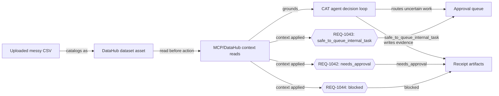

# CAT Context Agent — Lineage Decision Map

Generated: `demo-static-run`  
Source asset: `urn:li:dataset:(cat,messy_business_requests,PROD)`

This artifact shows the judge-visible source → DataHub context → agent decision → approval queue → receipt chain.

## Decision branches

| Request | Account | Decision | Safe next step | Blocked action | Receipt |
| --- | --- | --- | --- | --- | --- |
| `REQ-1042` | Acme HVAC | `needs_approval` | Ask for missing customer contact owner before follow-up | Do not send external follow-up | `cat-demo-REQ-1042` |
| `REQ-1043` | Northline Dental | `safe_to_queue_internal_task` | Create finance review task for invoice mismatch | — | `cat-demo-REQ-1043` |
| `REQ-1044` | Cedar Auto | `blocked` | Request a verified contact before customer action | Do not guess, scrape, or invent contact details | `cat-demo-REQ-1044` |

## Evidence anchors

- **Uploaded messy CSV** — `examples/cat-context-agent/messy-business-requests.csv`
- **DataHub dataset asset** — `examples/cat-context-agent/generated-datahub-metadata.json`
- **MCP/DataHub context reads** — `examples/cat-context-agent/generated-mcp-context-read.json`
- **CAT agent decision loop** — `hackathon-assets/decision-trace.md`
- **Approval queue** — `examples/cat-context-agent/generated-agent-output.json`
- **Receipt artifacts** — `examples/cat-context-agent/agent-receipts.json`
- **REQ-1042: needs_approval** — `cat-demo-REQ-1042`
- **REQ-1043: safe_to_queue_internal_task** — `cat-demo-REQ-1043`
- **REQ-1044: blocked** — `cat-demo-REQ-1044`

## Why this matters

- It makes DataHub the visible context layer in the decision path.
- It shows that CAT reads context before routing work.
- It separates safe internal work, approval-required work, and blocked work.
- It gives every decision an artifact judges can inspect.
